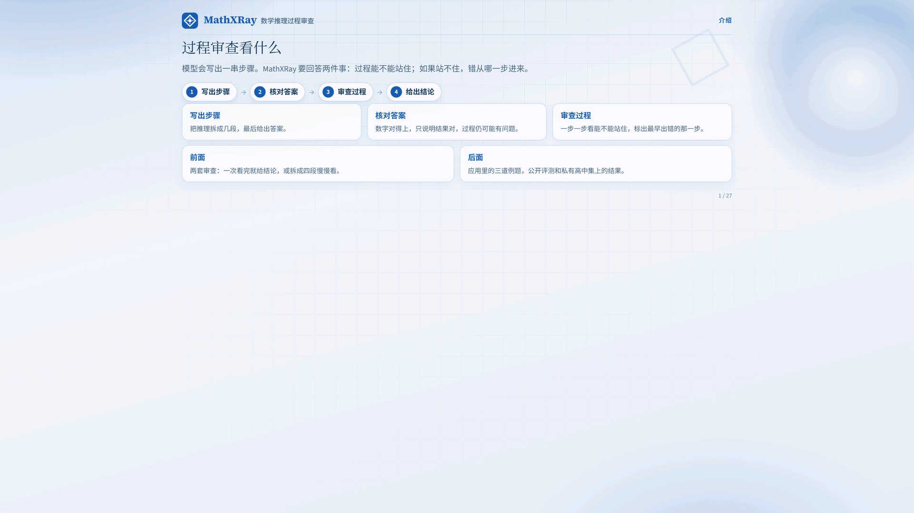
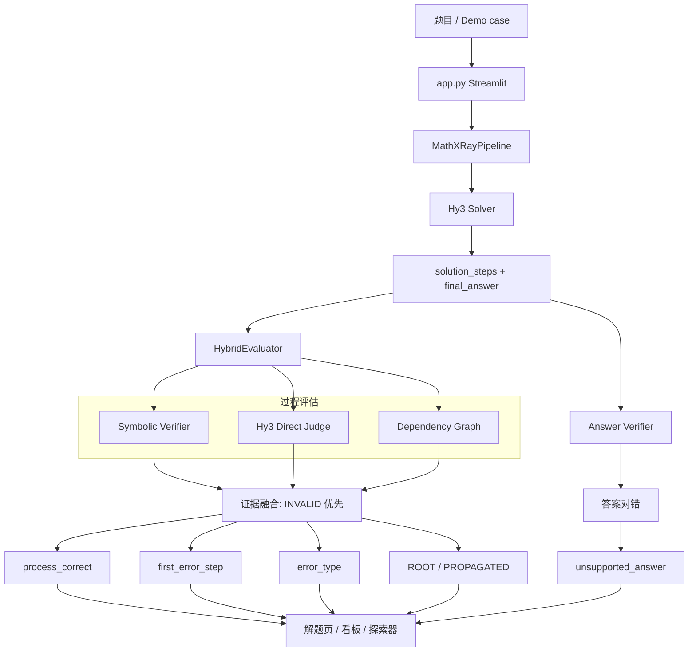

# MathXRay

> Hybrid Process Verification and Root-Cause Error Localization for Mathematical Reasoning

**Can a correct answer still be wrong?**

MathXRay 基于 **Hy3** 构建数学解题与过程审计应用：它不仅校验最终答案，还判断推理是否成立、定位 **earliest error**、归类错误，并标出「最终答案正确但过程无法支撑结论」的样本。

Hy3 在系统中的两个角色：

1. **Solver** — 输出公开、结构化的 `solution_steps + final_answer`
2. **Semantic Critic** — 对显式步骤做过程审查（B0 Direct Judge）

确定性 **SymPy** 证据优先于 LLM；依赖图只解释 ROOT / PROPAGATED，不改写外部 gold。

## 主结果（ProcessBench 三数据集）

GSM8K + MATH + Omni-MATH 上的 Hy3 Direct Judge（n = 244，由 `results/raw` 重算，见 [`reports/official/`](reports/official/)）：

| Metric | Value | 95% CI |
|---|---|---|
| M1 Error Detection Recall | **0.976** | 0.976 [0.952, 0.994] |
| **M2 First-Error Exact** | **0.782** | 0.782 [0.715, 0.842] |
| M3 Correct Process Accuracy | **0.873** | 0.873 [0.797, 0.937] |
| M4 Process Status Accuracy | 0.943 | — |
| M5 Official Composite | 0.811 | — |

| Source | 难度 | M2 Exact | M5 | n |
|---|---|---|---|---|
| GSM8K | D1 | 0.842 | 0.917 | 36 |
| MATH | D3 | 0.810 | 0.835 | 103 |
| Omni-MATH | D5 | 0.747 | 0.752 | 105 |

能力边界：First-Error Exact 最大相邻降幅在 **D3 → D5**（0.810 → 0.747，降幅 0.063）。Gold「答案正确但过程不成立」37 条，评估器召回 0.919。完整分析见 [`reports/final_report.md`](reports/final_report.md)。

> OlympiadBench 作为额外高难 split 写入 [`processbench_overall.md`](reports/official/processbench_overall.md)，不并入上表。

## 快速开始

```bash
python -m venv .venv
.venv\Scripts\activate
pip install -e .
copy .env.example .env   # 填入 HY3_API_KEY / HY3_BASE_URL / HY3_MODEL
```

启动应用：

```bash
streamlit run app.py
```

无需 API 即可播放三个演示案例（录 Demo 请用这一模式）。现场解题需要 `.env` 中的 Hy3 配置。

离线测试：

```bash
pytest
python scripts/run_b0_baseline.py --stage smoke --provider mock
```

## 评测

| 层 | 作用 | 入口 |
|---|---|---|
| **ProcessBench** | 过程评估器外部金标准 | `scripts/run_b0_baseline.py`，`scripts/aggregate_official.py` |
| **SolveBench** | Hy3 解题：GSM8K / MATH / Omni-MATH，D1–D5 | `scripts/prepare_solvebench.py`，`scripts/run_solvebench.py` |
| **TraceAdversarialBench** | 可控首错 / 类型 / unsupported | `scripts/build_adversarial.py`，`scripts/run_adversarial.py` |

数据构造、许可与分层规则：[`data/README.md`](data/README.md)。指标口径：[`docs/evaluation_protocol.md`](docs/evaluation_protocol.md)。

## 应用页面

1. **解题与审计** — Hy3 步骤、答案校验、逐步 verdict、ROOT 错误、Unsupported 警告
2. **评测看板** — 读取 `reports/official/`，不手填数字
3. **错误探索** — 按来源 / 状态 / 类型筛选 raw 样本

## Demo（≤2 分钟）

循环预览（约 19 秒，1280×800）：



成片分镜与口播：[`docs/demo_script.md`](docs/demo_script.md)。重新截取：先 `streamlit run app.py`，再 `python scripts/capture_demo_gif.py`（需本机 Chrome 与 `pip install selenium`）。

## 复现实验

```bash
python scripts/run_b0_baseline.py --stage dev          # ProcessBench Direct Judge（可 resume）
python scripts/aggregate_official.py
python scripts/replay_full_hybrid.py
python scripts/prepare_solvebench.py --n 90 --seed 42
python scripts/run_solvebench.py --max-samples 90
python scripts/build_adversarial.py --n 80 --seed 42
python scripts/run_adversarial.py --provider none --method Full
python scripts/generate_final_report.py
```

API Key **只**来自环境变量。不要提交 `.env`。

## 架构



评测不经过 UI：`scripts/run_b0_baseline.py` 只走 Direct Judge，把预测写入 `results/raw`；`aggregate_official.py` 从 raw 重算 `reports/official/`。

## 调用流程

**现场解题（应用）**

1. `app.py` 读 `configs/default.yaml` + `.env`
2. `src/factory.py` 组装 `MathSolver` 与 `HybridEvaluator`
3. `src/pipeline.py`：`solve` → `answer_verifier.verify` → `hybrid.audit_texts`
4. Solver：`hy3_provider` + `prompts/solver.md` → `parser` / `schema`
5. Hybrid：`symbolic.verify_step`（确定性 INVALID 优先）+ `direct_judge`（`prompts/direct_judge.md`）+ `dependency.build_graph`
6. 页面渲染答案、过程、ROOT 步、Unsupported 横幅

演示案例跳过 2–5，直接读 `data/demo_cases.json`。看板读 `reports/official/*.json`。探索器读 `results/raw/*.jsonl`。

**ProcessBench 评测**

`run_b0_baseline.py` → `processbench_adapter` → `runner` → `DirectJudge` → `results/raw/*.jsonl` → `aggregate_official.py` → `reports/official/` → `generate_final_report.py`

**可控错误集**

`build_adversarial.py` → `data/processed/adversarial.jsonl` → `run_adversarial.py`（符号融合，可 `--provider none`）

## 仓库结构

```
app.py                      Streamlit 三页：解题 / 看板 / 探索器
pyproject.toml              包名、依赖、pytest 配置
.env.example                HY3_API_KEY / BASE_URL / MODEL 样例（不要提交 .env）
.gitignore
课题2.pdf                   官方课题原文

configs/
  default.yaml              日常运行配置（温度、超时、路径）
  formal_eval.yaml          正式冻结配置骨架

prompts/
  solver.md                 Hy3 解题：输出结构化步骤
  direct_judge.md           Hy3 过程审查：对错 / 首错 / 类型

src/
  config.py                 YAML + 环境变量；API key 只来自 env
  factory.py                组装 provider / solver / judge / hybrid
  pipeline.py               解题 → 答案校验 → 过程审计
  taxonomy.py               一级错误类型与传播标签
  cache.py                  请求缓存（key 含 model/prompt/config/input）
  run_metadata.py           run_id / commit / 稳定哈希
  llm/                      Hy3 OpenAI-compatible 客户端与 mock
  solver/                   结构化步骤 schema、解析、MathSolver
  verifier/                 最终答案自动校验（exact / numeric / SymPy / set）
  evaluator/                Direct Judge、符号验证、依赖图、混合融合
  benchmark/                ProcessBench / SolveBench / Adversarial 适配
  analysis/                 M1–M5、bootstrap CI、official 表

scripts/                    评测与报告入口，见下表
data/                       Demo 案例、冻结题集与 manifest
results/                    raw JSONL 与 summaries（gitignored 生成物）
reports/                    正式结果、人工抽检、final_report
docs/                       需求、口径、里程碑、方案、Demo 脚本
tests/                      离线单测（mock，不打真实 API）
.streamlit/config.toml      演示时隐藏多余工具栏
```

脚本入口：

| 脚本 | 作用 |
|---|---|
| `run_b0_baseline.py` | ProcessBench Direct Judge（smoke/pilot/dev，可 resume） |
| `aggregate_official.py` | 从 raw 重算 `reports/official/` |
| `replay_full_hybrid.py` | 用已存 B0 预测 + 本地符号验证回放 Full |
| `prepare_solvebench.py` | 构造 SolveBench 分层子集 |
| `run_solvebench.py` | Hy3 解题 + 答案校验 + 过程审计 |
| `build_adversarial.py` | 从 gold-correct 轨迹注入可控错误 |
| `run_adversarial.py` | 在对抗集上评测定位 / 类型 |
| `preflight_processbench.py` | 确认 ProcessBench schema 与 label 语义 |
| `extract_diagnosis.py` | 从 raw 生成人工核对清单 `reports/baseline_diagnosis.md` |
| `generate_final_report.py` | 写出 `reports/final_report.md` |

数据与报告：

| 路径 | 作用 |
|---|---|
| `data/demo_cases.json` | 三个录屏案例（成立 / 首错 / unsupported） |
| `data/processed/solvebench.jsonl` | 冻结 SolveBench |
| `data/processed/adversarial.jsonl` | 冻结 TraceAdversarialBench |
| `reports/official/processbench_three_datasets.*` | 三数据集主表（应用看板读取 JSON） |
| `reports/official/processbench_overall.*` | 含 OlympiadBench 的总表 |
| `reports/manual_audit.csv` | R12 人工抽检 |
| `reports/baseline_diagnosis.md` | gold vs 预测分歧清单（由 raw 生成） |
| `reports/B0-DirectJudge_smoke_翻译与分析.md` | smoke 逐条翻译与分析 |
| `reports/final_report.md` | 分析报告 |
| `reports/preflight_processbench.md` | label 0-based / −1 语义冻结记录 |

`results/raw/` 与 `results/summaries/` 是评测生成物（体积大且可能含数据集原文，故 gitignore），**本地不要删除**。正式对外数字以 `reports/official/` 为准，但必须能从 raw 重算。

## 局限

ProcessBench 主数字来自分层子集而非全量 3400。无过程 gold 的集合上不报告 Process Accuracy。符号验证对无等式叙述步骤返回 UNKNOWN。

## 引用

- ProcessBench: Qwen/ProcessBench
- GSM8K, MATH, Omni-MATH: 见各数据集卡片
- Hy3: https://github.com/Tencent-Hunyuan/Hy3
