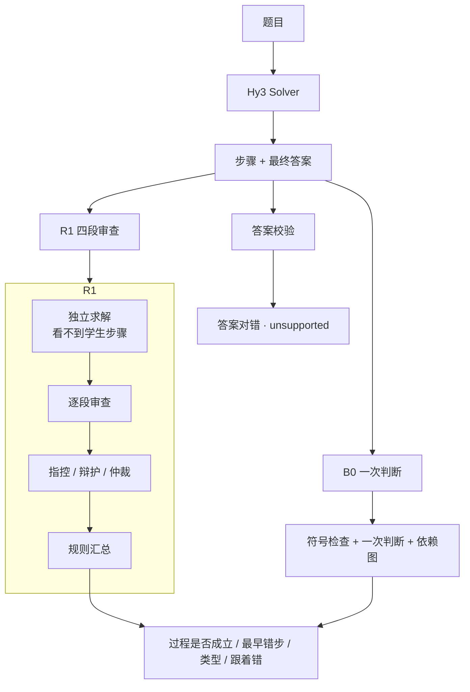
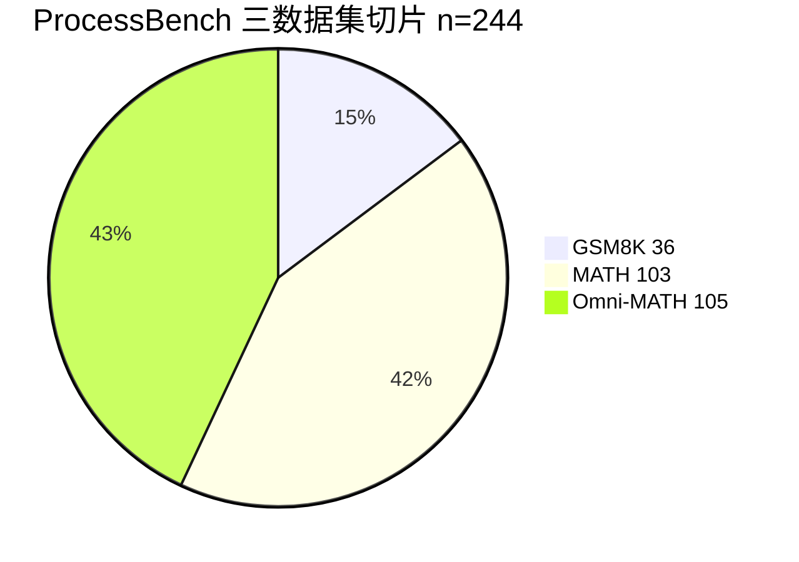

# MathXRay


**MathXRay** : 基于 Hy3 的数学题目审查应用。能够判断题目的答案是否正确，审查具体解答过程正确与否并进行定位。


## 启动应用

1. 创建环境并安装依赖：

```bash
python -m venv .venv
.venv\Scripts\activate
pip install -e .
```

1. 复制 `.env.example` 为 `.env`，填入 `HY3_API_KEY`、`HY3_BASE_URL`、`HY3_MODEL`。不要把 `.env` 提交进仓库。只看演示题时可以先不填。
2. 启动：

```bash
streamlit run app.py
```

浏览器打开终端地址（ `http://localhost:8501`）。


| 页面    | 实现功能                       |
| ----- | ------------------------- |
| 解题与审查 | 三道演示题不用接口；也可以贴自己的题，调用 Hy3 |
| 评测看板  | 公开集和私有集上的数字               |
| 错误探索  | 按来源和过程状态翻原始样本             |

Hy3 在项目里有两个角色：**Solver** 写出步骤和最终答案；**Critic** 审查这些步骤。审查可切换：


|      | B0 Direct Judge（一次性判断）          | R1 Reflective Critic（反思批判）             |
| ---- | ------------------------ | -------------------------------- |
| 实现   | 一次看完题目全文，直接给出过程对错、首错步、错误类型 | 自己先做一遍 → 一段一段看 → 对不上再对质 → 按规则下结论 |
| 公开评测 | ProcessBench 主结果         | 尚未在 ProcessBench 上运行             |
| 应用   | 可选                       | 默认                               |


离线检查：

```bash
pytest
python scripts/run_b0_baseline.py --stage smoke --provider mock
```

## 本评测框架的审查流程



R1 对质只在以下情况下打开：独立结论和学生答案对不上、某段解题过程是 UNKNOWN、或答案校验失败。汇总顺序：符号 INVALID → 仲裁 → 未反驳的指控 → 逐段第一个 INVALID → 答案对不上则过程不能成立。

## 数据集

评测数据集：①公开数据集；②个人构建的高中数学习题语料。构造说明见 `[data/README.md](data/README.md)`，指标设计见 `[docs/evaluation_protocol.md](docs/evaluation_protocol.md)`。

### ProcessBench

第三方过程评测。每条样本带「最早错误步号」（从 0 计，过程成立为 −1）。本仓库使用分层切片。


| 来源            | 难度  | 切片条数    | 内容                    |
| ------------- | --- | ------- | --------------------- |
| GSM8K         | D1  | 36      | 小学应用题                 |
| MATH          | D3  | 103     | 竞赛数学                  |
| Omni-MATH     | D5  | 105     | 更难的奥林匹克风格             |
| 三集合计          | —   | **244** | 对外主表                  |
| OlympiadBench | D4  | 105     | 附加高难 split，写入总表 n=349 |


切片构成：



Gold 侧（三数据集）：过程有错 165，过程成立 79；其中答案对但过程不成立 37 条。

入口：`scripts/run_b0_baseline.py`，`scripts/aggregate_official.py`。正式数字在 `[reports/official/](reports/official/)`，由 `results/raw` 重算。

### SolveBench

用来看 Hy3 **解题**能力，和过程审查分开记账。从 GSM8K / MATH / Omni-MATH 按难度分层抽样，seed 42，默认 90 道，带标准答案。

```bash
python scripts/prepare_solvebench.py --n 90 --seed 42
python scripts/run_solvebench.py --max-samples 90
```

输出：`data/processed/solvebench.jsonl`。

### TraceAdversarialBench

在 ProcessBench 过程成立的轨迹上注入可控错误，得到可编程的首错步和错误类型。


| 改法     | 类型   | 是否保持答案 |
| ------ | ---- | ------ |
| 改数字    | 计算错误 | 否      |
| 改符号    | 计算错误 | 否      |
| 换运算符   | 代数错误 | 否      |
| 插入无关式子 | 幻觉   | 是      |


默认 80 条，seed 42。入口：`scripts/build_adversarial.py`，`scripts/run_adversarial.py`。

### 私有数据集-高中数学题集

该数据集包含约 4300 道高中选择 / 填空题，配套有官方详解，本项目通过调用Qwen系列27B以上大模型为**4297** 道题目生成逐步解答。

私有语料构成


| 字段 / 子集    | 规模   | 说明          |
| ---------- | ---- | ----------- |
| 有逐步解答      | 4297 | 评测只使用这些     |
| 模型答案与参考一致  | 1343 | 过程好不好仍未知    |
| 模型答案与参考不一致 | 370  | 过程至少有问题     |
| 答案能否对齐不确定  | 2584 | 形式或抽取对不上    |
| 冻结评测切片     | 88   | seed 42，见下表 |


冻结切片 `data/processed/highschool_{smoke,pilot}.jsonl` ：


| 子集       | smoke | pilot | 能看什么         |
| -------- | ----- | ----- | ------------ |
| 模型答案已经算错 | 6     | 28    | 能不能发现过程有问题   |
| 模型答案算对了  | 6     | 28    | 会不会把对的过程判错   |
| 官方详解     | 6     | 16    | 会不会把教材步骤判不成立 |
| 在官方步骤上改错 | 6     | 16    | 能不能指到被改的那一步  |


```bash
python scripts/prepare_highschool.py --stage pilot
python scripts/run_highschool_b0.py --stage pilot --provider hy3
python scripts/run_highschool_reflective.py --stage pilot --provider hy3
```

R1 在该切片上开启 `answer_aware`：答案对不上则过程不能成立。对照表：`[reports/highschool_compare.json](reports/highschool_compare.json)`，说明：`[reports/experiment_report.md](reports/experiment_report.md)`。

## 实验结果

### ProcessBench（B0，Hy3）

三数据集 n=244：


| 指标         | 数值    | 95% CI         |
| ---------- | ----- | -------------- |
| 发现过程有错 M1  | 0.976 | [0.952, 0.994] |
| 指出最早错步 M2  | 0.782 | [0.715, 0.842] |
| 放过正确过程 M3  | 0.873 | [0.797, 0.937] |
| 过程状态准确率 M4 | 0.943 | —              |
| 综合 M5      | 0.811 | —              |


指出首错随数据集


| 来源            | M1   | M2   | M3   | n   |
| ------------- | ---- | ---- | ---- | --- |
| GSM8K         | 1.00 | 0.84 | 1.00 | 36  |
| MATH          | 1.00 | 0.81 | 0.88 | 103 |
| Omni-MATH     | 0.95 | 0.75 | 0.77 | 105 |
| OlympiadBench | 0.91 | 0.69 | 0.89 | 105 |


加上 OlympiadBench 后 n=349，M2 约 0.75。答案对但过程不成立的样本，三数据集上召回约 0.92。预测错误类型里，概念错误、题意误读、计算错误较多，完整表见 `[reports/official/processbench_three_datasets.md](reports/official/processbench_three_datasets.md)`。

### 个人构建的高中数学题数据集

B0 与 R1 对照


|               | B0          | R1          |
| ------------- | ----------- | ----------- |
| 答案错误：发现过程有问题  | 4/28（0.14）  | 28/28（1.00） |
| 改错样本：指到被改的那一步 | 11/16（0.69） | 12/16（0.75） |
| 官方详解：认为过程成立   | 7/16（0.44）  | 6/16（0.38）  |
| 后两行调和平均       | 0.54        | 0.50        |
| 答案正确样本被判过程错   | 4/28        | 5/28        |


R1 在「答案已经算错」的 28 道上全部判有问题，其中约 18 道是答案规则改判的，逐步审查自己标 INVALID 的大约 5 道。改错 16 道上，定位主要靠逐段审查。官方详解上 R1 更严，所以两项折中略低于 B0。这批数字用来看失败模式和调提示，不能代替 ProcessBench 主表。R1 也还没有在 ProcessBench 上评过。

## 仓库导读

```
app.py                      四个页面
configs/default.yaml        温度、超时、路径
prompts/                    solver、direct_judge、independent_solve、
                            stepwise_critic、accuser、defender、arbiter
src/factory.py              组装 Solver / B0 / R1
src/pipeline.py             MathXRayPipeline（B0）、ReflectivePipeline（R1）
src/evaluator/              一次判断、混合融合、四段审查、符号、依赖图
src/llm/                    Hy3 客户端与 mock
scripts/                    评测、切片
reports/official/           对外数字
docs/figures/               README 用图
```


| 脚本                                                      | 作用                |
| ------------------------------------------------------- | ----------------- |
| `run_b0_baseline.py`                                    | ProcessBench B0   |
| `aggregate_official.py`                                 | 从 raw 重算 official |
| `prepare_highschool.py`                                 | 冻结高中切片            |
| `run_highschool_b0.py` / `run_highschool_reflective.py` | 高中集 B0 / R1       |
| `prepare_solvebench.py` / `run_solvebench.py`           | 解题评测              |
| `build_adversarial.py` / `run_adversarial.py`           | 可控改错集             |


`results/raw/` 体积大，已 gitignore，本地不要删。评测可按样本 + 方法 + 运行签名续跑。

## 总结

MathXRay 把「算出答案」和「步骤是否成立」分开处理。B0 一次判断已经能在 ProcessBench 上较高比例地发现错误，中等比例地指出第一处错误；难度上去，定位会下降。R1 把审查拆开，应用里可以顺着独立求解、逐段标记和对质往回看。私有高中集上，R1 更会抓住答案已经错了和形式没收齐的解答，对官方详解更严，综合没有超过 B0。参考答案不进提示，答案对不上只作为过程不能成立的开关。

## 下一步

1. 在 ProcessBench 上跑 R1，和 B0 用同一套公开口径对照。
2. 放松逐步审查和指控对教材跳步的处理，减少把官方详解判错。
3. 把「答案对不上」和「指出第几步」继续分列，避免把规则改判算进定位。
4. 为形式不完整单独设一类错误，并在提示里写清收束要求。
5. 若要在私有集上认真报定位，需要逐步对错的人工标注，或扩大可控改错子集。

## 引用

- ProcessBench: Qwen/ProcessBench
- GSM8K, MATH, Omni-MATH, OlympiadBench：见各数据集说明
- Hy3: [https://github.com/Tencent-Hunyuan/Hy3](https://github.com/Tencent-Hunyuan/Hy3)